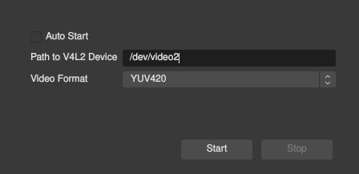
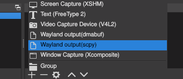
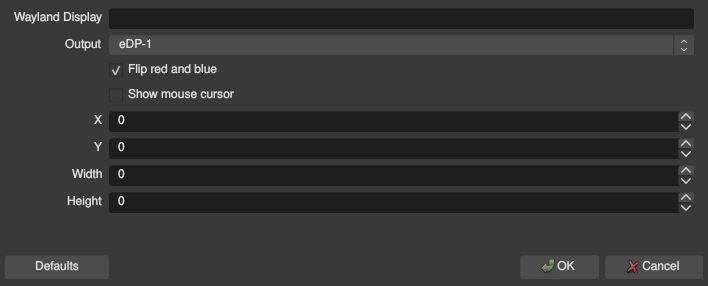

Screen Sharing with OBS Studio on Arch Linux and Sway
===
If this guide gets out of date, 
feel free to submit a merge/pull request with updated information.

**PLEASE read the instructions of the listed self-built projects.**
**They may have changed.**


## Used Software
- [OBS Studio](https://obsproject.com/)
- [v4l2loopback](https://github.com/umlaeute/v4l2loopback)
- [obs-v4l2sink](https://github.com/CatxFish/obs-v4l2sink)
- [wlrobs](https://hg.sr.ht/~scoopta/wlrobs)


## Install OBS Studio
OBS Studio can be downloaded from the Arch Community Repository.
```sh
pacman -S obs-studio
```

In order to be drawn correctly, 
OBS needs the QT_QPA_PLATFORM environment variable specifically set to `xcb`.
```sh
# run OBS with
QT_QPA_PLATFORM=xcb obs

# I aliased it to 'obs' in my zsh config
alias obs="QT_QPA_PLATFORM=xcb obs"
```


## Install the v4l2loopback kernel module
'This module allows you to create "virtual video devices".' - from the 
[v4l2loopback github page](https://github.com/umlaeute/v4l2loopback).
Visit it for more information about it.

This is needed to feed an video output from OBS and 
be used as a screen or a camera by applications.

The DKMS Version is available in the Arch Community Repository.
More information about DKMS can be found in the [Arch Wiki](https://wiki.archlinux.org/index.php/Dynamic_Kernel_Module_Support).

```sh
pacman -S v4l2loopback-dkms linux-headers

sudo dkms add -m v4l2loopback -v 0.12.5
sudo dkms build -m v4l2loopback -v 0.12.5
sudo dkms install -m v4l2loopback -v 0.12.5

dkms status v4l2loopback/0.12.5

# load the module and
# create one virtual video device
modprobe v4l2loopback 
```

> Further helpful commands:
>```sh
># the ones with the highest numbers are created by v4l2loopback
>ls /dev/video*
>
># unloads the kernel module
>modprobe -r v4l2loopback
>
># creates 4 virtual video devices
>modprobe v4l2loopback devices=4
>```


## Install the obs-v4l2sink OBS-plugin
This is needed to actually select a v4l2 virtual video device 
(created by the v4l2loopback kernel module) in OBS as an output.
More information on it's [github page](https://github.com/CatxFish/obs-v4l2sink).

Now we are going to compile the plugin ourself.
So that everything is a bit orderly, 
I go to a folder in which I store my self-built packages and other stuff.
```sh
cd ~/builds
```

The instructions in the obs-v4l2sink README are only refering to apt packages.
It worked for me without installing additional dependencies.
However, I already got the `qt5-base` package installed.
But I don't know about the `libobs-dev` package. 
I couldn't find an equivalent in the Arch Repositories.

```sh
# in the aforementioned builds directory 
# clone the obs-studio source code because 
# an included library is needed by obs-v4l2sink
git clone --recursive https://github.com/obsproject/obs-studio.git

# this is copied from their README.md
git clone https://github.com/CatxFish/obs-v4l2sink.git
cd obs-v4l2sink
mkdir build && cd build
cmake -DLIBOBS_INCLUDE_DIR="../../obs-studio/libobs" -DCMAKE_INSTALL_PREFIX=/usr ..
make -j4
sudo make install
```


## Usage of obs-v4l2sink
Now you can just follow the [Usage](https://github.com/CatxFish/obs-v4l2sink/blob/master/README.md#usage-with-v4l2loopback) instructions from obs-v4l2sink:

- Open OBS and select the menu entry `Tools > V4L2 Video Output` 
- Fill in the Device Path and select the appropriate video format.
    >In my case the first created v4l2sink device was `/dev/video2`.
    >
- Click the `Start` button.

Now you are able to use a stream from OBS as a screen or a camera.


## Install the wlrobs OBS-plugin
This plugin is responsible for actually recording screens from wlroots-based compositors. Like Sway.

The plugin can be found [here](https://hg.sr.ht/~scoopta/wlrobs).
It is a Mercurial repository.
```sh
# back to the builds directory
cd ~/builds
```

Again the following basically worked for me.
But you can set some options to disable specific backends.
I didn't. 
The `screencopy` backend works on my setup and the `dmabuf` backend doesn't.
(Apparently you can compile OBS with an EGL backend and dmabuf works with that,
as is stated in the plugin repository.)
```sh
# clone with the mercurial VCS
# actually my first time using mercurial
hg clone https://hg.sr.ht/~scoopta/wlrobs
cd wlrobs
meson build
ninja -C build
mkdir -p ~/.config/obs-studio/plugins/wlrobs/bin/64bit
cp build/libwlrobs.so ~/.config/obs-studio/plugins/wlrobs/bin/64bit
```


## Usage of wlrobs
Now choose `Wayland output(scpy)` as new input source.


I had to flip the blue and red values from the source, 
in order to display colors correctly. 
This can be done in the source preferences.


Now you should be able to share your screen i.e. in Firefox.
You can test it [here](https://mozilla.github.io/webrtc-landing/gum_test.html).

Thank you for reading. 
Feel free to reach out to me, 
if something is incorrect or out of date.


## Versions of the used projects at the time of writing (2021-02-04)
> Arch Linux 5.10.12-arch1-1
>
> SwayWM 1:1.5.1-1
>
> OBS 26.1.2-1 (Arch Community Repository)
>
> v4l2loopback-dkms 0.12.5-1 (Arch Community Repository)
>
> obs-v4l2sink [master at this commit](https://github.com/CatxFish/obs-v4l2sink/commit/36d5bdb888be708ac9b22c11dff477fcd6511ccf)
>
> wlrobs [default at this commit](https://hg.sr.ht/~scoopta/wlrobs/rev/02e7fd0062aff91c02a1915f0ca29e906877a01d)
